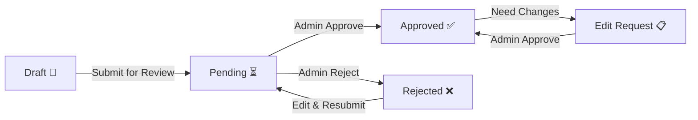

# 📚 Modern Quiz Workflow Guide

## 🎯 **OVERVIEW**

Hệ thống quiz đã được nâng cấp lên workflow hiện đại giống **Kahoot, Quizizz, Google Forms**:

✅ **Auto-save Draft** - Tự động lưu khi soạn thảo  
✅ **Preview Mode** - Xem trước trước khi publish  
✅ **Review System** - Admin duyệt trước khi public  
✅ **Role-Based Access** - Phân quyền rõ ràng  
✅ **Password Protection** - Quiz có mật khẩu  

---

## 👥 **PHÂN QUYỀN HỆ THỐNG**

### **1. Admin (Quản trị viên)**
- ✅ Xem/quản lý **TẤT CẢ** quiz (draft, pending, approved, rejected)
- ✅ Duyệt quiz của creator (approve/reject)
- ✅ Thay đổi status của bất kỳ quiz nào
- ✅ Xóa bất kỳ quiz nào
- ✅ Quản lý users và creators

### **2. Creator (Người tạo nội dung)**
- ✅ Tạo quiz mới (status = `draft`)
- ✅ Xem/chỉnh sửa quiz **CỦA MÌNH**
- ✅ Submit quiz để admin duyệt (draft → pending)
- ⚠️ **KHÔNG THỂ** tự approve quiz
- ⚠️ **KHÔNG THỂ** chỉnh sửa quiz đã approved (phải gửi edit request)
- ✅ Xem quiz approved của tất cả mọi người

### **3. User (Người dùng)**
- ✅ Xem danh sách quiz **APPROVED** (đã duyệt)
- ✅ Làm quiz public (không mật khẩu)
- ✅ Làm quiz có mật khẩu (sau khi nhập password đúng)
- ❌ Không xem được quiz draft/pending
- ❌ Không tạo được quiz

---

## 🔄 **QUIZ STATUS WORKFLOW**



### **Status Meanings**

| Status | Icon | Meaning | Who Can See |
|--------|------|---------|-------------|
| `draft` | 📝 | Đang soạn thảo | Owner + Admin |
| `pending` | ⏳ | Chờ duyệt | Owner + Admin |
| `approved` | ✅ | Đã duyệt - Public | Everyone |
| `rejected` | ❌ | Bị từ chối | Owner + Admin |

---

## 📝 **DRAFT WORKFLOW - Người tạo quiz**

### **Step 1: Create New Quiz (Auto-Draft)**

```tsx
// Khi creator tạo quiz mới
const newQuiz = {
  title: "My Quiz",
  status: 'draft',  // Tự động = draft
  createdBy: userId,
  visibility: 'public' // or 'password'
}
```

### **Step 2: Auto-Save While Editing**

```tsx
import { useAutoSaveDraft } from '@/features/quiz/hooks/useAutoSaveDraft';

// Trong component CreateQuiz
const { saveDraft, isSaving } = useAutoSaveDraft({
  quizId: quizId,
  quizData: formData,
  enabled: true,
  debounceMs: 2000, // Save sau 2s không thay đổi
  onSave: () => {
    console.log('✅ Draft saved');
    setLastSaved(new Date());
  },
  onError: (error) => {
    console.error('❌ Save failed:', error);
  }
});

// UI indicator
{isSaving && <p>💾 Saving...</p>}
{lastSaved && <p>✅ Last saved: {lastSaved.toLocaleTimeString()}</p>}
```

**Features:**
- ✅ Tự động lưu sau 2 giây không thay đổi
- ✅ Lưu khi rời trang (unmount)
- ✅ Visual indicator (Saving... / Last saved)
- ✅ Không lưu nếu quiz đã approved

### **Step 3: Preview Before Publish**

```tsx
import { QuizPreviewModal } from '@/features/quiz/components/QuizPreviewModal';

const [showPreview, setShowPreview] = useState(false);

// Button
<button onClick={() => setShowPreview(true)}>
  👁️ Preview Quiz
</button>

// Modal
<QuizPreviewModal
  isOpen={showPreview}
  onClose={() => setShowPreview(false)}
  quiz={quizData}
  onProceedToPublish={() => {
    setShowPreview(false);
    setShowPublish(true);
  }}
/>
```

**Preview Shows:**
- ✅ Quiz title, description
- ✅ Stats (questions count, difficulty, time limit)
- ✅ Settings (visibility, category, resources)
- ✅ Questions preview (first 5)
- ✅ Validation warnings (e.g., < 3 questions)

### **Step 4: Publish Settings**

```tsx
import { QuizPublishModal } from '@/features/quiz/components/QuizPublishModal';

const [showPublish, setShowPublish] = useState(false);

<QuizPublishModal
  isOpen={showPublish}
  onClose={() => setShowPublish(false)}
  quizTitle={quiz.title}
  currentStatus={quiz.status}
  onPublish={async (settings) => {
    // settings contains:
    // - visibility: 'public' | 'password'
    // - password?: string
    // - requireReview: boolean
    // - schedulePublish?: boolean
    // - publishDate?: string
    // - notifyUsers?: boolean
    
    if (settings.requireReview) {
      // Submit for review (status → pending)
      await submitForReview(quizId, settings);
    } else {
      // Publish immediately (status → approved)
      await publishQuiz(quizId, settings);
    }
  }}
/>
```

**Publish Options:**

1. **Visibility**
   - 🌐 **Public**: Mọi người làm được
   - 🔒 **Password Protected**: Cần mật khẩu

2. **Review**
   - ✅ **Submit for Review**: Admin duyệt trước (recommended)
   - ⚠️ **Publish Immediately**: Lên luôn (only admin)

3. **Schedule** (optional)
   - 📅 Đặt thời gian publish tương lai

4. **Notifications**
   - 🔔 Thông báo followers khi publish

---

## 🛡️ **FIRESTORE RULES PHÂN QUYỀN**

### **Metadata Read Access**

```javascript
match /quizzes/{quizId} {
  allow get, list: if signedIn() && (
    // Admin sees all
    isAdmin() ||
    // Owner sees their own quizzes
    resource.data.createdBy == request.auth.uid ||
    // Everyone sees approved quizzes
    resource.data.status == 'approved'
  );
}
```

**Giải thích:**
- Admin: Xem tất cả quiz (draft, pending, approved, rejected)
- Owner: Xem quiz của mình (mọi status)
- User thường: **CHỈ** xem quiz approved

### **Questions Read Access**

```javascript
match /quizzes/{quizId}/questions/{qid} {
  allow read: if signedIn() && (
    // Admin can read all
    isAdmin() ||
    // Owner can read their own quiz questions
    quizDoc(quizId).data.createdBy == request.auth.uid ||
    // Regular users: only approved + (public OR unlocked)
    (quizDoc(quizId).data.status == 'approved' && (
      quizDoc(quizId).data.visibility == "public" ||
      (quizDoc(quizId).data.visibility == "password" && hasAccess(quizId))
    ))
  );
}
```

**Giải thích:**
- Admin/Owner: Luôn đọc được (để quản lý)
- User thường: **CHỈ KHI**
  - Quiz đã approved **VÀ**
  - (Public **HOẶC** đã unlock password)

### **Quiz Write Access**

```javascript
// CREATE
allow create: if signedIn() && (
  isCreator() || isAdmin()
) && request.resource.data.status == 'draft';

// UPDATE
allow update: if signedIn() && (
  // Admin can update any quiz and change status
  isAdmin() ||
  // Owner can update their draft/rejected quizzes only
  (resource.data.createdBy == request.auth.uid && 
   resource.data.status in ['draft', 'rejected'])
);
```

**Giải thích:**
- Tạo mới: Creator/Admin, status **PHẢI** = draft
- Sửa quiz:
  - Admin: Sửa được mọi quiz, thay đổi status
  - Owner: **CHỈ** sửa draft/rejected của mình
  - Owner **KHÔNG THỂ** sửa pending/approved

---

## 🔐 **PASSWORD PROTECTION**

### **Tạo Quiz Có Mật Khẩu**

```tsx
// When publishing with password
const publishSettings = {
  visibility: 'password',
  password: 'mySecretPassword123',
  requireReview: true
};

await onPublish(publishSettings);
```

Backend sẽ:
1. Hash password: `SHA-256(salt + ":" + password)`
2. Lưu vào Firestore:
```javascript
{
  visibility: 'password',
  pwd: {
    enabled: true,
    hash: 'a1b2c3...', // SHA-256 hash
    salt: 'xyz123...',  // Random 32-byte
    hint: 'Optional hint'
  }
}
```

### **User Làm Quiz Có Mật Khẩu**

1. User click quiz → Modal nhập password xuất hiện
2. User nhập password
3. Client compute: `proofHash = SHA-256(salt + ":" + password)`
4. Client gửi proofHash lên Firestore:
```javascript
// Create access token
await setDoc(doc(db, 'quizzes', quizId, 'access', userId), {
  proofHash: proofHash,
  unlockedAt: serverTimestamp()
});
```
5. Firestore rules kiểm tra:
```javascript
allow create: if signedIn() &&
  request.resource.data.proofHash == quizDoc(quizId).data.pwd.hash;
```
6. Nếu đúng → Access token created → User có thể đọc questions

---

## 🔍 **TESTING GUIDE**

### **Test 1: Admin Permissions**

```bash
# Login as Admin
# Navigate to /admin/quizzes

Expected:
✅ See all quizzes (draft, pending, approved, rejected)
✅ Can approve/reject pending quizzes
✅ Can edit any quiz
✅ Can delete any quiz
```

### **Test 2: Creator Draft Workflow**

```bash
# Login as Creator
# Create new quiz

Expected:
✅ Quiz created with status = 'draft'
✅ Auto-save indicator appears after changes
✅ Can preview quiz before publishing
✅ Publish modal shows review option
✅ After submit → status = 'pending'
✅ Cannot edit while pending
```

### **Test 3: User Access Control**

```bash
# Login as User
# Browse /quizzes

Expected:
✅ See only approved quizzes
❌ Do not see draft/pending quizzes
✅ Can click public quiz → Start immediately
✅ Click password quiz → Password modal appears
✅ Wrong password → Error message
✅ Correct password → Quiz unlocks
```

### **Test 4: Status Transitions**

```javascript
// Test sequence
1. Creator creates quiz → status = 'draft'
2. Creator submits → status = 'pending'
3. Admin approves → status = 'approved'
4. Creator tries to edit → Should see "Edit Request" option
5. Creator submits edit request → editRequests collection
6. Admin approves edit → Changes applied
```

---

## 🚀 **MIGRATION EXISTING QUIZZES**

Nếu có quiz cũ không có status field:

```javascript
// Run migration script
import { collection, getDocs, updateDoc, doc } from 'firebase/firestore';

const migrateQuizStatus = async () => {
  const quizzesRef = collection(db, 'quizzes');
  const snapshot = await getDocs(quizzesRef);
  
  for (const quizDoc of snapshot.docs) {
    const data = quizDoc.data();
    
    // Nếu chưa có status
    if (!data.status) {
      await updateDoc(doc(db, 'quizzes', quizDoc.id), {
        // Mặc định: quiz đã public → approved
        status: 'approved',
        updatedAt: serverTimestamp()
      });
      
      console.log(`✅ Migrated quiz ${quizDoc.id} → approved`);
    }
  }
};
```

---

## 📊 **FIRESTORE INDEX REQUIREMENTS**

File `firestore.indexes.json` đã có:

```json
{
  "indexes": [
    {
      "collectionGroup": "quizzes",
      "queryScope": "COLLECTION",
      "fields": [
        { "fieldPath": "status", "order": "ASCENDING" },
        { "fieldPath": "createdAt", "order": "DESCENDING" }
      ]
    },
    {
      "collectionGroup": "quizzes",
      "queryScope": "COLLECTION",
      "fields": [
        { "fieldPath": "createdBy", "order": "ASCENDING" },
        { "fieldPath": "status", "order": "ASCENDING" },
        { "fieldPath": "createdAt", "order": "DESCENDING" }
      ]
    }
  ]
}
```

**Deploy:**
```bash
firebase deploy --only firestore:indexes
```

---

## 🎨 **UI/UX IMPROVEMENTS**

### **Draft Indicator**

```tsx
// Show draft status
{quiz.status === 'draft' && (
  <div className="bg-gray-100 text-gray-700 px-3 py-1 rounded-full text-sm">
    📝 Draft - Auto-saving...
  </div>
)}

{lastSaved && (
  <p className="text-xs text-gray-500">
    ✅ Saved {formatDistanceToNow(lastSaved)} ago
  </p>
)}
```

### **Status Badge**

```tsx
const statusConfig = {
  draft: { bg: 'bg-gray-100', text: 'text-gray-800', icon: '📝' },
  pending: { bg: 'bg-yellow-100', text: 'text-yellow-800', icon: '⏳' },
  approved: { bg: 'bg-green-100', text: 'text-green-800', icon: '✅' },
  rejected: { bg: 'bg-red-100', text: 'text-red-800', icon: '❌' }
};

const config = statusConfig[quiz.status];
<span className={`${config.bg} ${config.text} px-3 py-1 rounded-full`}>
  {config.icon} {quiz.status}
</span>
```

---

## 🐛 **TROUBLESHOOTING**

### **Problem: Quiz vẫn visible cho user khi status = draft**

**Fix:** Check Firestore rules đã deploy:
```bash
firebase deploy --only firestore:rules
```

Verify rule:
```javascript
allow get, list: if resource.data.status == 'approved' || isAdmin() || isOwner();
```

### **Problem: Index error khi query**

**Fix:**
1. Click link trong error message
2. Hoặc deploy index: `firebase deploy --only firestore:indexes`
3. Đợi vài phút để index build xong

### **Problem: Auto-save không hoạt động**

**Check:**
1. `enabled` prop = true?
2. `quizData` có thay đổi?
3. Status = draft/rejected? (không save nếu approved)

---

## 📞 **SUPPORT**

Có vấn đề? Check:
- [ ] Rules đã deploy? `firebase deploy --only firestore:rules`
- [ ] Indexes đã tạo? Check Firebase Console
- [ ] User role đúng? Check users collection
- [ ] Quiz status đúng? Check quizzes collection

---

**Version:** 2.0.0  
**Last Updated:** Nov 2025  
**Author:** Quiz System Team
