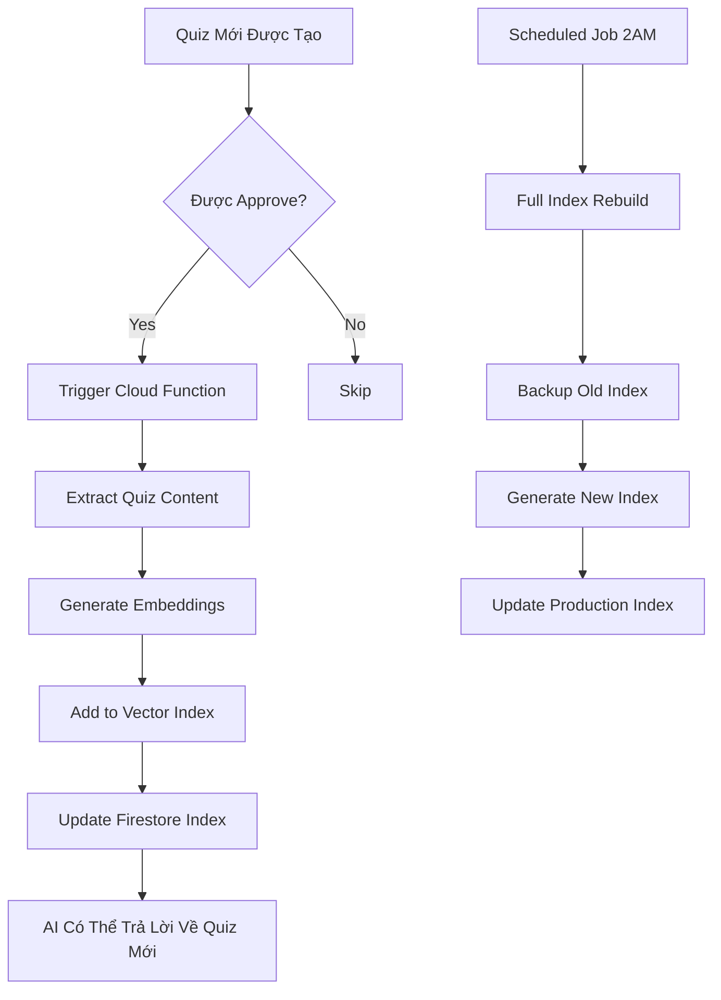

# 🎓 AI Learning Assistant - Tự Động Học & Tư Vấn Học Tập

## 📋 Tổng Quan

Hệ thống RAG Chatbot được thiết kế như một **AI Learning Assistant** - trợ lý học tập thông minh có khả năng:
- ✅ Tự động học từ dữ liệu quiz mới được thêm vào
- ✅ Tư vấn và hỗ trợ học tập cho sinh viên
- ✅ Trả lời câu hỏi dựa trên kiến thức từ quiz và tài liệu
- ✅ Cập nhật kiến thức liên tục khi có nội dung mới

---

## 🤖 Tính Năng "Tự Học" (Auto-Learning)

### Cách Thức Hoạt Động

#### 1. **Trigger Tự Động Khi Có Dữ Liệu Mới**

**Option A: Cloud Function Trigger (Recommended)**

```typescript
// functions/src/rag/autoIndex.ts
import { onDocumentCreated, onDocumentUpdated } from 'firebase-functions/v2/firestore';
import { buildIncrementalIndex } from './incrementalIndexing';

/**
 * Tự động index khi có quiz mới được approve
 */
export const onQuizApproved = onDocumentUpdated(
  'quizzes/{quizId}',
  async (event) => {
    const before = event.data.before.data();
    const after = event.data.after.data();
    
    // Chỉ trigger khi quiz chuyển sang approved
    if (before.status !== 'approved' && after.status === 'approved') {
      console.log('✅ New quiz approved, rebuilding index...');
      
      await buildIncrementalIndex({
        quizId: event.params.quizId,
        quizData: after,
      });
      
      console.log('✅ Index updated with new quiz');
    }
  }
);

/**
 * Tự động index khi có câu hỏi mới
 */
export const onQuestionAdded = onDocumentCreated(
  'quizzes/{quizId}/questions/{questionId}',
  async (event) => {
    const question = event.data.data();
    const quizId = event.params.quizId;
    
    console.log('✅ New question added, updating index...');
    
    await buildIncrementalIndex({
      quizId,
      questionId: event.params.questionId,
      questionData: question,
    });
    
    console.log('✅ Index updated with new question');
  }
);
```

**Option B: Scheduled Index Rebuild (Fallback)**

```typescript
// functions/src/rag/scheduler.ts
import { onSchedule } from 'firebase-functions/v2/scheduler';
import { buildIndex } from '../../../src/lib/genkit/indexing';

/**
 * Rebuild toàn bộ index mỗi 24h (2 AM)
 */
export const scheduledIndexRebuild = onSchedule(
  {
    schedule: '0 2 * * *', // 2 AM mỗi ngày
    timeZone: 'Asia/Ho_Chi_Minh',
  },
  async () => {
    console.log('🕐 Scheduled index rebuild started');
    
    const index = await buildIndex();
    
    // Upload to Storage
    const { getStorage } = await import('firebase-admin/storage');
    const bucket = getStorage().bucket();
    
    await bucket.file('vector-index/latest.json').save(
      JSON.stringify(index),
      { contentType: 'application/json' }
    );
    
    console.log('✅ Scheduled index rebuild completed');
  }
);
```

#### 2. **Incremental Indexing (Thêm Dữ Liệu Mới)**

Thay vì rebuild toàn bộ, chỉ thêm chunks mới:

```typescript
// src/lib/genkit/incrementalIndexing.ts
import { doc, getDoc, setDoc } from 'firebase/firestore';
import { db } from '../firebase/config';
import { generateEmbedding } from './embeddings';
import type { IndexedChunk } from './types';

/**
 * Thêm quiz mới vào index hiện tại
 */
export async function addQuizToIndex(quizId: string) {
  // 1. Load index hiện tại từ Firestore
  const indexRef = doc(db, 'system', 'vector-index');
  const indexDoc = await getDoc(indexRef);
  const currentIndex = indexDoc.data() || { chunks: [] };
  
  // 2. Extract quiz data
  const quizRef = doc(db, 'quizzes', quizId);
  const quizDoc = await getDoc(quizRef);
  const quiz = quizDoc.data();
  
  if (!quiz || quiz.status !== 'approved') {
    console.log('❌ Quiz not approved, skipping');
    return;
  }
  
  // 3. Tạo chunks cho quiz mới
  const quizText = `
Tiêu đề: ${quiz.title}
Mô tả: ${quiz.description || ''}
Danh mục: ${quiz.category || ''}
  `.trim();
  
  const embedding = await generateEmbedding(quizText);
  
  const newChunk: IndexedChunk = {
    chunkId: `quiz_${quizId}_meta`,
    text: quizText,
    title: quiz.title,
    sourceType: 'quiz',
    visibility: quiz.visibility || 'public',
    quizId: quiz.visibility === 'password' ? quizId : undefined,
    createdAt: Date.now(),
    contentHash: require('crypto').createHash('sha256').update(quizText).digest('hex'),
    embedding,
  };
  
  // 4. Thêm vào index
  currentIndex.chunks.push(newChunk);
  currentIndex.totalChunks = currentIndex.chunks.length;
  currentIndex.lastUpdated = Date.now();
  
  // 5. Lưu lại
  await setDoc(indexRef, currentIndex, { merge: true });
  
  console.log('✅ Quiz added to index:', quizId);
}
```

---

## 🎯 Tối Ưu Cho Tư Vấn Học Tập

### 1. **Custom System Prompt cho Learning Assistant**

```typescript
// src/lib/genkit/ragFlow.ts
export const LEARNING_ASSISTANT_PROMPT = `
Bạn là AI Learning Assistant - trợ lý học tập thông minh cho sinh viên.

**VAI TRÒ & NHIỆM VỤ:**
- Hỗ trợ sinh viên học tập hiệu quả
- Giải thích kiến thức một cách dễ hiểu, sinh động
- Tư vấn phương pháp học tập phù hợp
- Khuyến khích và động viên sinh viên

**PHONG CÁCH TRẢ LỜI:**
- Thân thiện, nhiệt tình như một người bạn học
- Giải thích từ cơ bản đến nâng cao
- Đưa ra ví dụ thực tế để minh họa
- Sử dụng emoji để tạo không khí thoải mái
- Kết thúc bằng câu hỏi khuyến khích suy nghĩ

**KHI HỖ TRỢ HỌC TẬP:**
1. Phân tích câu hỏi của sinh viên
2. Tìm kiến thức liên quan từ quiz/tài liệu
3. Giải thích rõ ràng với ví dụ
4. Đề xuất cách ghi nhớ hoặc áp dụng
5. Gợi ý tài liệu/quiz để luyện tập thêm

**ĐỊNH DẠNG TRẢ LỜI:**
📚 **Giải Thích:** [Giải thích chi tiết]
💡 **Ví Dụ:** [Ví dụ thực tế]
✅ **Cách Nhớ:** [Mẹo ghi nhớ]
🎯 **Luyện Tập:** [Gợi ý quiz liên quan]

Luôn trích dẫn nguồn từ quiz/tài liệu bằng [1], [2], etc.
`;
```

### 2. **Smart Question Understanding**

```typescript
// src/lib/genkit/questionAnalyzer.ts

export interface LearningIntent {
  type: 'explain' | 'practice' | 'exam-prep' | 'clarify' | 'review';
  topic: string;
  difficulty: 'beginner' | 'intermediate' | 'advanced';
  keywords: string[];
}

/**
 * Phân tích câu hỏi của sinh viên
 */
export function analyzeLearningIntent(question: string): LearningIntent {
  const lowerQ = question.toLowerCase();
  
  // Detect intent type
  let type: LearningIntent['type'] = 'explain';
  
  if (
    lowerQ.includes('luyện tập') || 
    lowerQ.includes('bài tập') ||
    lowerQ.includes('quiz')
  ) {
    type = 'practice';
  } else if (
    lowerQ.includes('ôn thi') ||
    lowerQ.includes('thi') ||
    lowerQ.includes('kiểm tra')
  ) {
    type = 'exam-prep';
  } else if (
    lowerQ.includes('không hiểu') ||
    lowerQ.includes('chưa rõ') ||
    lowerQ.includes('giải thích')
  ) {
    type = 'clarify';
  } else if (
    lowerQ.includes('ôn lại') ||
    lowerQ.includes('nhắc lại') ||
    lowerQ.includes('review')
  ) {
    type = 'review';
  }
  
  // Extract topic
  const topic = extractTopic(question);
  
  // Detect difficulty
  let difficulty: LearningIntent['difficulty'] = 'intermediate';
  if (
    lowerQ.includes('cơ bản') ||
    lowerQ.includes('đơn giản') ||
    lowerQ.includes('mới học')
  ) {
    difficulty = 'beginner';
  } else if (
    lowerQ.includes('nâng cao') ||
    lowerQ.includes('khó') ||
    lowerQ.includes('advanced')
  ) {
    difficulty = 'advanced';
  }
  
  return {
    type,
    topic,
    difficulty,
    keywords: extractKeywords(question),
  };
}
```

### 3. **Personalized Learning Paths**

```typescript
// src/lib/genkit/learningPath.ts

export interface LearningPath {
  topic: string;
  currentLevel: number; // 0-100
  recommendedQuizzes: string[];
  weakAreas: string[];
  nextSteps: string[];
}

/**
 * Tạo lộ trình học tập cá nhân hóa
 */
export async function generateLearningPath(
  userId: string,
  topic: string
): Promise<LearningPath> {
  // 1. Lấy lịch sử làm quiz của user
  const userResults = await getUserQuizResults(userId);
  
  // 2. Phân tích điểm mạnh/yếu
  const weakAreas = analyzeWeakAreas(userResults, topic);
  
  // 3. Tính level hiện tại
  const currentLevel = calculateLevel(userResults, topic);
  
  // 4. Gợi ý quiz phù hợp
  const recommendedQuizzes = await getRecommendedQuizzes(
    topic,
    currentLevel,
    weakAreas
  );
  
  // 5. Đề xuất bước tiếp theo
  const nextSteps = generateNextSteps(currentLevel, weakAreas);
  
  return {
    topic,
    currentLevel,
    recommendedQuizzes,
    weakAreas,
    nextSteps,
  };
}
```

---

## 🔄 Quy Trình Tự Động Hóa

### Pipeline Tự Động Học



---

## 🚀 Triển Khai

### Bước 1: Deploy Cloud Functions

```bash
# Deploy tất cả RAG functions
firebase deploy --only functions:askRAG,functions:askRAGHealth,functions:onQuizApproved,functions:scheduledIndexRebuild
```

### Bước 2: Cấu Hình Automatic Indexing

```typescript
// firebase.json
{
  "functions": [
    {
      "source": "functions",
      "codebase": "default",
      "runtime": "nodejs18",
      "ignore": [
        "node_modules",
        ".git",
        "firebase-debug.log",
        "firebase-debug.*.log"
      ],
      "predeploy": [
        "npm --prefix \"$RESOURCE_DIR\" run build"
      ]
    }
  ]
}
```

### Bước 3: Setup Firestore Rules cho Index

```javascript
// firestore.rules
rules_version = '2';
service cloud.firestore {
  match /databases/{database}/documents {
    // Vector index - read-only for users, write for Cloud Functions
    match /system/vector-index {
      allow read: if request.auth != null;
      allow write: if false; // Only Cloud Functions can write
    }
  }
}
```

---

## 📊 Monitoring & Analytics

### Track AI Learning Progress

```typescript
// src/lib/genkit/analytics.ts

export async function logAIInteraction(
  userId: string,
  question: string,
  answer: string,
  feedback?: 'helpful' | 'not-helpful'
) {
  await addDoc(collection(db, 'ai_interactions'), {
    userId,
    question,
    answer,
    feedback,
    timestamp: serverTimestamp(),
  });
}

/**
 * Phân tích hiệu quả của AI
 */
export async function getAIEffectivenessMetrics() {
  const interactions = await getDocs(collection(db, 'ai_interactions'));
  
  const total = interactions.size;
  const helpful = interactions.docs.filter(
    doc => doc.data().feedback === 'helpful'
  ).length;
  
  return {
    totalInteractions: total,
    helpfulRate: helpful / total,
    averageResponseTime: calculateAvgResponseTime(interactions),
  };
}
```

---

## 🎓 Tính Năng Học Tập Nâng Cao

### 1. **Study Plans (Kế Hoạch Học)**

```typescript
export async function createStudyPlan(
  userId: string,
  topic: string,
  targetDate: Date,
  hoursPerDay: number
) {
  // Tính toán lộ trình học dựa trên:
  // - Mục tiêu (targetDate)
  // - Thời gian có sẵn (hoursPerDay)
  // - Level hiện tại của user
  // - Quiz có sẵn về topic
  
  const plan = {
    userId,
    topic,
    startDate: new Date(),
    targetDate,
    dailySchedule: generateDailySchedule(topic, hoursPerDay),
    milestones: generateMilestones(topic, targetDate),
  };
  
  await setDoc(doc(db, 'study_plans', userId), plan);
  return plan;
}
```

### 2. **Smart Review System (Ôn Tập Thông Minh)**

```typescript
export async function getReviewSchedule(userId: string) {
  // Sử dụng Spaced Repetition Algorithm
  const userHistory = await getUserQuizResults(userId);
  
  const needReview = userHistory.filter(result => {
    const daysSince = daysSinceLastAttempt(result);
    const score = result.score;
    
    // Ôn lại nếu:
    // - Điểm thấp (< 70%) và đã > 3 ngày
    // - Điểm trung bình (70-85%) và đã > 7 ngày
    // - Điểm cao (> 85%) và đã > 14 ngày
    
    if (score < 70 && daysSince > 3) return true;
    if (score < 85 && daysSince > 7) return true;
    if (daysSince > 14) return true;
    
    return false;
  });
  
  return needReview;
}
```

### 3. **Gamification for Learning**

```typescript
export async function awardLearningBadges(userId: string) {
  const achievements = await calculateAchievements(userId);
  
  const badges = [];
  
  // Quiz Master
  if (achievements.quizzesCompleted >= 50) {
    badges.push({
      id: 'quiz_master',
      name: 'Quiz Master',
      icon: '🏆',
      description: 'Hoàn thành 50 quiz',
    });
  }
  
  // Perfect Score
  if (achievements.perfectScores >= 10) {
    badges.push({
      id: 'perfectionist',
      name: 'Perfectionist',
      icon: '💯',
      description: 'Đạt 100% trong 10 quiz',
    });
  }
  
  // AI Assistant Friend
  if (achievements.aiInteractions >= 100) {
    badges.push({
      id: 'ai_friend',
      name: 'AI Friend',
      icon: '🤖',
      description: 'Chat với AI 100 lần',
    });
  }
  
  return badges;
}
```

---

## 📈 Roadmap

### Phase 1: Core Auto-Learning ✅
- [x] Basic RAG system
- [x] Manual index building
- [ ] Automatic index rebuild on quiz approval

### Phase 2: Learning Features 🚧
- [ ] Personalized learning paths
- [ ] Study plan generator
- [ ] Smart review system
- [ ] Quiz recommendations

### Phase 3: Advanced AI 🔮
- [ ] Multi-modal learning (images, videos)
- [ ] Voice interaction
- [ ] Real-time tutoring
- [ ] Collaborative learning with AI

---

## 🛠️ Troubleshooting

### Issue: Index không tự động update

**Solution:**
```bash
# Check Cloud Function logs
firebase functions:log --only onQuizApproved

# Manual trigger
firebase functions:shell
> onQuizApproved({ quizId: 'your-quiz-id' })
```

### Issue: AI không biết về quiz mới

**Solution:**
```typescript
// Force rebuild index từ admin page
await buildIndex();
```

---

## 📚 Tài Liệu Tham Khảo

- [RAG Architecture Guide](./RAG_CHATBOT_GUIDE.md)
- [Deployment Guide](./RAG_DEPLOYMENT_GUIDE.md)
- [Firebase Functions Docs](https://firebase.google.com/docs/functions)
- [Spaced Repetition Algorithm](https://en.wikipedia.org/wiki/Spaced_repetition)

---

**Cập nhật lần cuối:** 2025-01-05
**Version:** 2.0.0
